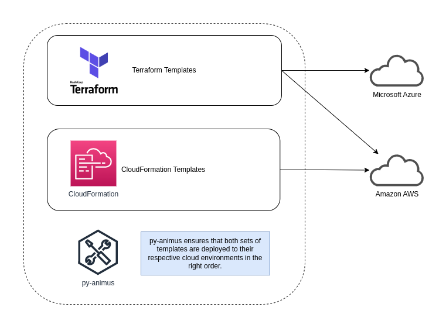

Quick Navigation: [Documentation home](../../README.md) | [Up](./README.md)

- [What is a "_Desired State_"](#what-is-a-desired-state)
- [See Also](#see-also)

# What is a "_Desired State_"

In the context of [Infrastructure as Code](https://en.wikipedia.org/wiki/Infrastructure_as_code) (wikipedia), a desired state is what a object is expected to be as defined in a manifest or by using a series of commands. `py-animus` will process all manifests and delegate each manifest to the extension responsible for the implementation logic that will attempt to achieve the state as expressed in that manifest.

A very simple human expression may be something like: "_I want a virtual machine with at least 4x Intel type cores and 10 GiB of storage_". In a cloud service like Amazon AWS, such a virtual machine is typically defined in a JSON or YAML file. In the case of AWS, this is known as a [CloudFormation template](https://en.wikipedia.org/wiki/AWS_CloudFormation). However, this virtual machine [resource](./01-what-is-a-resource.md) could also be defined in other IaC tools like [Terraform](https://en.wikipedia.org/wiki/Terraform_(software)).

How desired state is defined in `py-animus` is explained in more detail in the [the section](./03-defining-desired-resource-state-in-a-manifest.md) dealing with `py-animus` manifests. In terms of `py-animus`, the focus is not really on the individual resources, but more on orchestrating the various backends (like CloudFormation and Terraform) to achieve an overall desired state at the level of an organization (or organizational unit). In this context, `py-animus` also assumes that infrastructure state requirements may ve different depending on different scenarios like [deploying in different environments](./06-environments.md). 

Therefore, `py-animus` is more than just a "_I want X deployed_", but rather it can be seen as "_Ensure resources for Cloud A is provisioned before resources for Cloud B_", while at the same time "_Cloud A_" and "_Cloud B_" may be using very different approaches (like the CloudFormation and Terraform examples).

As such, `py-animus` makes available better flow control to ensure desired state is achieved in a certain order taking into account certain potential dependencies that can not otherwise be expressed in a IaC way.

Technically it is possible to achieve a similar result using tools like Terraform, but it may not always be practical in larger organization or more complex scenarios. Therefore, `py-animus` is a tool that serves a very specific purpose in the world of IaC.

# See Also

* [What is a resource](./01-what-is-a-resource.md)
* [Defining desired resource state in a Manifest](./03-defining-desired-resource-state-in-a-manifest.md)
* [Actions that can be performed to enforce resource state](./04-actions-that-can-be-performed-to-enforce-resource-state.md)
* [Extensions for every resources](./05-extensions-for-every-resources.md)
* [How to think of Environments](./06-environments.md)
* [How to use Values](./07-values.md)
* [Using Variables](./08-variables.md)
* [Planning and Project Hierarchy, Dependencies and Other Consideration](./09-planning-and-hierarchy.md)

Quick Navigation: [Documentation home](../../../README.md) | [Up](./README.md)